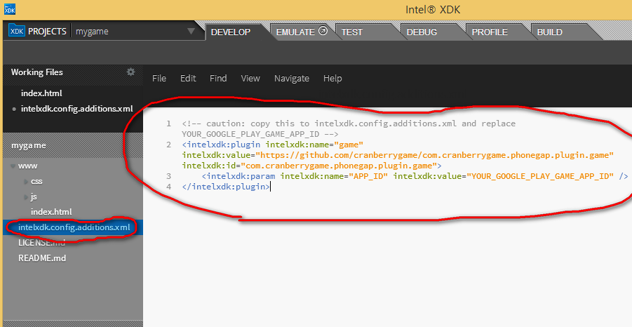

## Prerequisite ##

<pre>
</pre>

## How to Install ##

<pre>
//caution: replace YOUR_GOOGLE_PLAY_GAME_APP_ID
cordova plugin add https://github.com/cranberrygame/com.cranberrygame.phonegap.plugin.game --variable APP_ID="YOUR_GOOGLE_PLAY_GAME_APP_ID"

[android]

//add leaderboards and achievements
google play developer console - Game services - Add a new game - Enter the name of your game, choose its category, and click Continue. - ... - add leaderboards and achievements

//get APP_ID
google play developer console - Game services - [specific app] - get APP_ID (the number that appears beside the game name in the header of the Developer Console, e.g. "My Super Game - 12345678",. The APP_ID in this case is 12345678.)

[ios]

itunesconnect-Manage Your Apps-[specific app]-Manage Game Center-Enable for Single Game-Add Leaderboard-Leaderboard ID-don't need to wait for review
</pre>

## How to install (crosswalk) ##

<pre>
<!-- caution: copy this to intelxdk.config.additions.xml and replace YOUR_GOOGLE_PLAY_GAME_APP_ID -->
<intelxdk:plugin intelxdk:name="game" intelxdk:value="https://github.com/cranberrygame/com.cranberrygame.phonegap.plugin.game" intelxdk:id="com.cranberrygame.phonegap.plugin.game">
	<intelxdk:param intelxdk:name="APP_ID" intelxdk:value="YOUR_GOOGLE_PLAY_GAME_APP_ID" />
</intelxdk:plugin>

[crosswalk for android, android]

//add leaderboards and achievements
google play developer console - Game services - Add a new game - Enter the name of your game, choose its category, and click Continue. - ... - add leaderboards and achievements

//get APP_ID
google play developer console - Game services - [specific app] - get APP_ID (the number that appears beside the game name in the header of the Developer Console, e.g. "My Super Game - 12345678",. The APP_ID in this case is 12345678.)

[ios]

itunesconnect-Manage Your Apps-[specific app]-Manage Game Center-Enable for Single Game-Add Leaderboard-Leaderboard ID-don't need to wait for review
</pre>

## Change log ##

<pre>
</pre>

## To-Do ##

<pre>
</pre>	

## How to Use ##

<pre>
document.addEventListener("deviceready", function(){
	window.game.setUp();

	//callback
    window.game.onLoginSucceeded = function() {
        alert('onLoginSucceeded');
    };	
    window.game.onLoginFailed = function() {
        alert('onLoginFailed');
    };
    window.game.onSubmitScoreSucceeded = function() {
        alert('onSubmitScoreSucceeded');
    };	
    window.game.onSubmitScoreFailed = function() {
        alert('onSubmitScoreFailed');
    };	
    window.game.onSubmitAchievementSucceeded = function() {
        alert('onSubmitAchievementSucceeded');
    };	
    window.game.onSubmitAchievementFailed = function() {
        alert('onSubmitAchievementFailed');
    };
}, false);

//
window.game.login();
window.game.logout();
//
var leaderboardId = "REPLACE_THIS_WITH_YOUR_LEADERBOARD_ID";
var score = 5;
window.game.submitScore(leaderboardId, score);
window.game.showLeaderboard(leaderboardId);
//
var achievementId = "REPLACE_THIS_WITH_YOUR_ACHIEVEMENT_ID";
var percent = 30;
window.game.submitAchievement(achievementId, percent);
window.game.showAchievements();
</pre>

## Example ##

<a href="https://github.com/cranberrygame/com.cranberrygame.phonegap.plugin.game/blob/master/example/index.html">example/index.html</a>

## How to test ##

<pre>
[android] [crosswalk for android]

upload a signed (caution: signed) release APK to either alpha (recommended) or beta.

//test user
google play developer console - Game services - [specific app] - test - add tester

//publish your app
send email with https://play.google.com/apps/testing/YOUR_PACKAGE url to test user

wait until the url is available (take hours)

install app on a device from url or local signed apk with test account.

[ios]

just run
</pre>

## Download construct2 plugin ##

<a href="https://www.scirra.com/forum/viewtopic.php?t=109586">Scirra</a>

## Support ##

This is 100% Free. 
<a href="https://www.paypal.com/cgi-bin/webscr?cmd=_donations&business=F9MJ2UY9EKXRN&lc=KR&item_name=Phonegap%20game%20plugin%20donation&currency_code=USD&bn=PP%2dDonationsBF%3abtn_donateCC_LG%2egif%3aNonHosted">You can support maintenance by donation</a>

